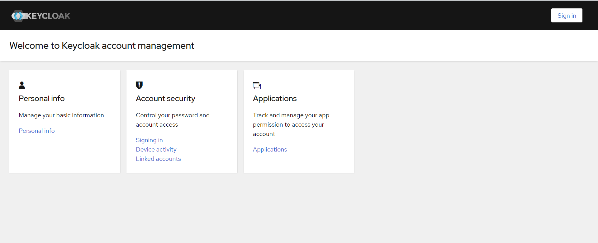
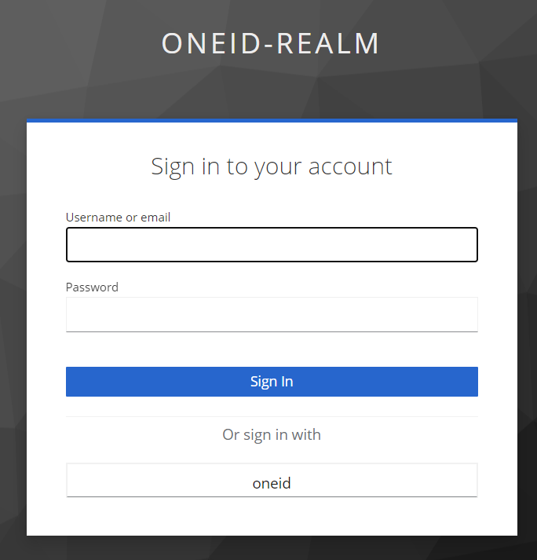

# :sunglasses: Implementing custom Keycloak identity provider via Java code

## Quick start

### 1. Set credentials
We should override **CLIENT_ID** and **CLIENT_SECRET** variables. 
These variables are located in `src/main/java/uz/sardorbroo/keycloak/authenticator/OneIdProviderConfig`.

### 2. Build the .jar
> ./mvnw clean package

### 3. Copy the .jar
Copy the .jar(`target/*.jar`) to `keycloak-properties/custom-idp-properties`

### 4. Build Keycloak container
Run the **keycloak.yml** file. Or run the command.
> docker compose -f keycloak.yml up

### 5. Verify
We can check all steps via browser.
Follow the link http://localhost:9080/realms/oneid-realm/account/

Click the `Sign in` button.

Click the `oneid` button.

### :partying_face: I congratulate you, you have Keycloak app which is integrated to OneID.uz
